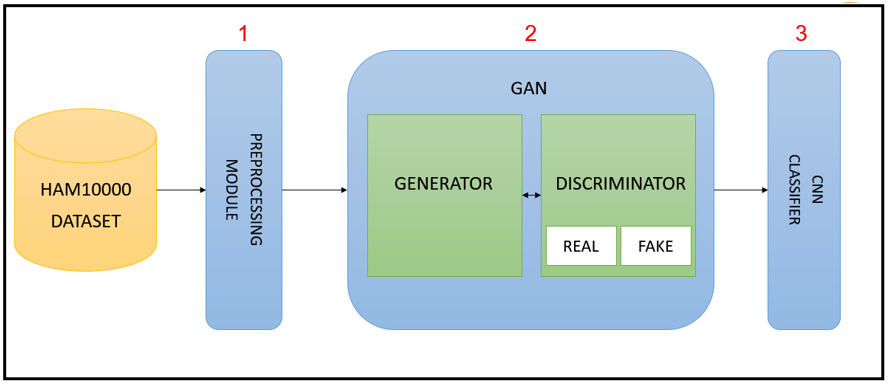

# Generative Adversarial Networks for Melanoma Detection

This repository hosts the codebase, models, and evaluation metrics for the paper:

> **"Generative Adversarial Networks for Melanoma Detection"**  
> *Kripang Kanwar Kashyap, Sudhanshu Makharia, S. Poornima*  
> Published at **3rd International Conference on Intelligent Systems, Advanced Computing and Communication (ISACC 2025)**  
> [Read on IEEE Xplore](https://ieeexplore.ieee.org/document/10969311)

---

## 🧠 Project Overview

Melanoma is one of the deadliest skin cancers and early detection is crucial for patient survival. Traditional diagnostic methods are error-prone and data imbalance in skin lesion datasets reduces the efficacy of automated solutions.

This project introduces a **GAN-based data augmentation pipeline** that generates synthetic melanoma images to **balance** the dataset, enhancing the performance of several machine learning classifiers including CNN, SVM, KNN, Random Forest, and Naïve Bayes.

---

## 📊 Key Results

| Model               | Accuracy (With GAN) |
|--------------------|---------------------|
| CNN                | 93%                 |
| SVM                | 93%                 |
| Random Forest      | 93%                 |
| KNN                | 92%                 |
| Naïve Bayes        | 87%                 |
| CNN (No GAN)       | 81%                 |

GAN-enhanced CNN achieved a **12% improvement** over the baseline.

---

## 🏗️ Architecture

The solution is divided into two modules:

1. **GAN Module** – Generates synthetic melanoma images using a DCGAN architecture.
2. **Classifier Module** – Evaluates the impact of augmented data on various classifiers.

 <!-- Replace with actual image path -->

---

## 📁 Dataset

We use the **HAM10000** dataset from the [ISIC archive](https://www.kaggle.com/datasets/kmader/skin-cancer-mnist-ham10000). It includes ~11,000 dermoscopic images across 7 skin lesion types.

> Note: Melanoma is underrepresented in this dataset (only ~1000 images), hence the need for GAN-generated images.

---

## Citation
If you use this repository or refer to the methods in the paper, please cite the following:

K. K. Kashyap, S. Makharia and S. Poornima, "Generative Adversarial Networks for Melanoma Detection," 2025 3rd International Conference on Intelligent Systems, Advanced Computing and Communication (ISACC), Silchar, India, 2025, pp. 49-55, doi: 10.1109/ISACC65211.2025.10969311.

## Contact
If you have any questions or suggestions, feel free to open an issue in this repository or contact me at sudhanshumakharia50@gmail.com
